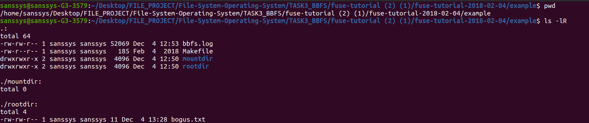
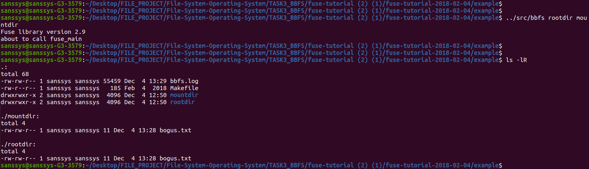
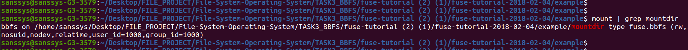
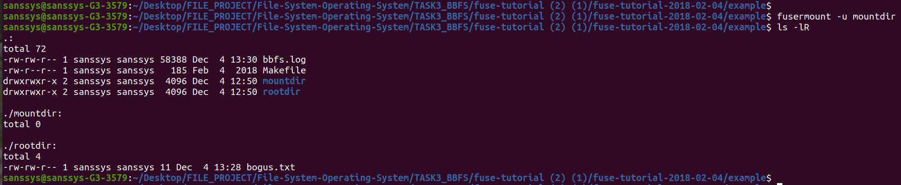
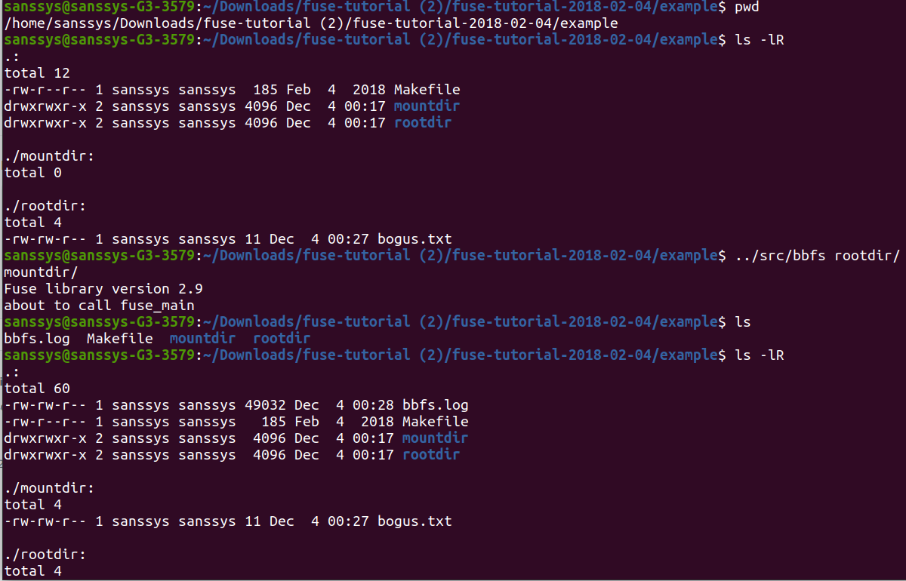
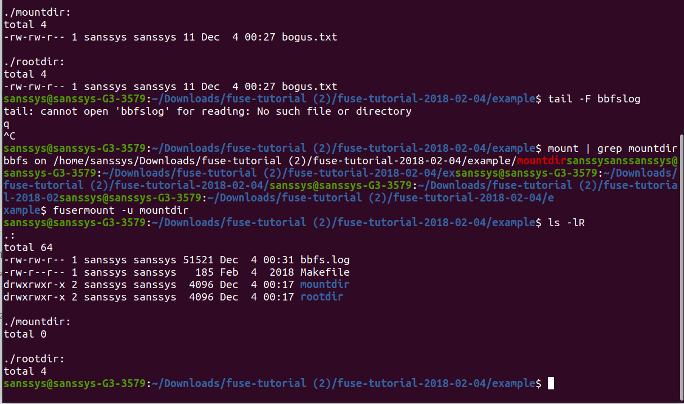

BBFS (Big Brother Filesystem (Using FUSE))
=======================================
In this task, we have build a simple in-memory filesystem that supports the creating of new files and directories.

**What’s Our Example Filesystem Going To Do?**
The filesystem simply passes every operation down to an underlying directory, but logs the operation.

**Demo**
After Configuring and compiling the make file,
we mount the directories in the 'Example' folder

--------------------------------------------------------
You mount a BBFS filesystem by running the command bbfs (in general, a FUSE filesystem is implemented by a program, and you mount it by running that program). bbfs has two required arguments: the root directory (which contains the actual directory data) and the mount directory. The tutorial tarball includes an example directory, which contains two subdirectories named rootdir and mountdir. You can verify that rootdir contains a single file named bogus.txt, while mountdir is empty

-----------------------------------------------------------------
Now, if you go into the example directory and execute

../src/bbfs rootdir mountdir
all of the files that are really in rootdir appear to also be in mountdir"

-------------------------------
Unmounting
Finally, you can unmount the filesystem with

-------------------------
Overall

**All Reference from:**
https://www.cs.nmsu.edu/~pfeiffer/fuse-tutorial/

